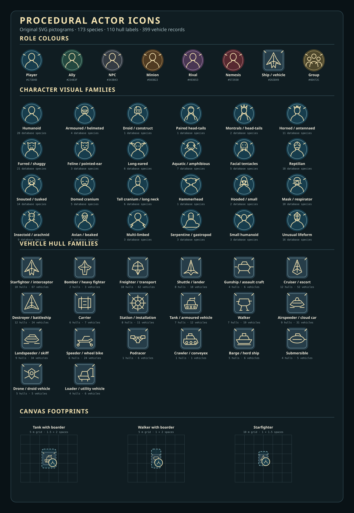
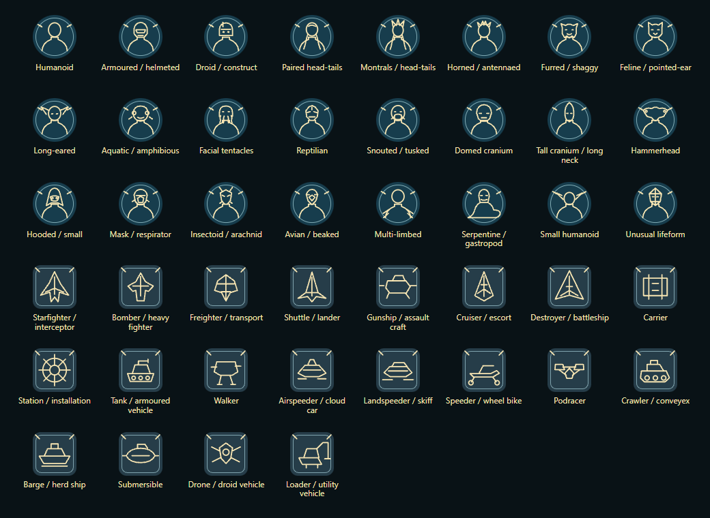

# Procedural actor icons

Star Wars FFG supplies original, deterministic SVG artwork when an actor has no selected portrait. Nothing is generated by an image model and the SVG contains no external resources.

Background colour identifies the actor's table role: player, ally, NPC, minion, rival, nemesis, ship or vehicle, and Group. The line symbol is selected from an abstract species family for characters and a hull family for vehicles. A GM can override the role through `flags.star-wars-ffg.iconRole`; vehicle sheets expose the hull selector directly.

The visual taxonomy contains 24 character families and 20 vehicle families. Every one of the 173 distinct species names, 110 hull labels and 399 vehicle records in the published reference database has an explicit assignment. The families are intentionally abstract identifiers rather than copied likenesses or claims of exact anatomy. New or community-provided names use a labelled fallback until their mapping is reviewed.

Character badges remain circular. Vehicle portraits use the established rounded-square frame; their token badges adapt to the occupied rectangle. Both retain the inner frame and the marks at 10 and 2 o'clock. The marks rotate with a token and therefore provide a simple facing cue. A custom portrait keeps the same frame on the character sheet and canvas.

Vehicle tags reach the outer rounded edge and cross the inner ring at their midpoints. Generated badges already contain their frame, so the canvas adds no second outline. Custom portrait frames follow the displayed image dimensions within the token's occupied footprint.

The files remain SVGs. Foundry's canvas rasterizes them into cached textures: vehicles declare 2048 pixels on their longer axis, with the other axis proportional to the token footprint; characters declare 512 × 512. Vehicle backgrounds, inner borders and corner tags fill the rectangle, while the hull symbol stays centred and scales uniformly. A token resize regenerates its badge in the same update. It does not change its occupied dimensions or stored bearing. Custom images retain their chosen fit. Extreme magnification beyond the texture resolution can still soften edges.

Facing uses Foundry's native bearings: 0° south, 90° west, 180° north and 270° east. Our north-facing artwork receives a 180° display offset; movement, sight and DoR continue reading the unchanged Token document rotation. New portrait prototypes default to north so newly placed actors are upright. Existing placed tokens keep their stored bearings, which can visibly turn older icons whose former orientation was backwards. Rotation locks and separately chosen token artwork retain their normal behaviour.

The actor portrait is also the default prototype-token image, so Actors, sheets and newly placed tokens share one identity. On world load, existing placed tokens that still use Foundry's mystery-person image or an earlier system-managed badge are brought into sync. A deliberately selected prototype-token or placed-token image is preserved; changing a token image manually removes it from later automatic portrait updates.

Choosing a database species or vehicle model updates the matching default portrait and managed tokens. A vehicle model resets the hull-symbol override to automatic, so the database hull and purpose determine its symbol and role colour. A custom portrait or separately selected token image remains intact.

`npm run audit:icons` renders every family in Chromium at 64 pixels and measures the actual SVG geometry. It also decodes every SVG as an image to check its intrinsic canvas resolution. It fails for an off-centre character head/body pair, a glyph outside the protected frame area, vehicle tags that miss the ring midpoint or outer edge, undersized image sources, or an unmapped database species or vehicle. The latest machine-readable result is [actor-icon-audit.json](actor-icon-audit.json).

Vehicle sheets also store a footprint. Automatic mode sizes the square token from silhouette alone; hull selects only the drawing. The metre values are a display calibration, not a rules-defined conversion from silhouette to physical dimensions. Exact mode accepts published dimensions in metres. When a vehicle is placed, the system converts those dimensions through the current scene's grid distance and unit and rounds outward to the nearest half-grid space. Gridless scenes ignore latent grid-distance fields and use a bounded visual size.

The native right-click token HUD provides CW and CCW buttons: 45 degrees per click, or 15 degrees with Shift. Rotation respects token ownership and rotation locks. It changes the native bearing without automatically spending a manoeuvre; facing adjustments alone do not establish that a rules manoeuvre occurred. [Turn indicators](turn-indicators.md) track that expenditure separately.

Vehicle tokens preserve their bearing when moved. The system disables Foundry's movement auto-rotation for vehicles before the move commits, covering its animation and stored bearing without locking explicit rotation. Character and adversary tokens retain the core auto-rotation preference.

Finer angular increments would be a presentation control, not a turning allowance. The Edge of the Empire core rules describe abstract vehicle movement (printed p. 232). For attacks against silhouette 4 or smaller, the defender normally chooses the defence zone; silhouette 5+ uses relative combat position (p. 235), with specific actions such as Gain the Advantage applying their own exceptions. A displayed token angle must not silently replace those decisions.

Vehicles sort below character tokens so a character can be placed over a tank, walker or other boardable vehicle. Manually resizing a placed vehicle disables later automatic resizing for that token. The public `game.system.api.actorIcons.resetVehicleTokenFootprint(token)` helper restores automatic sizing.
