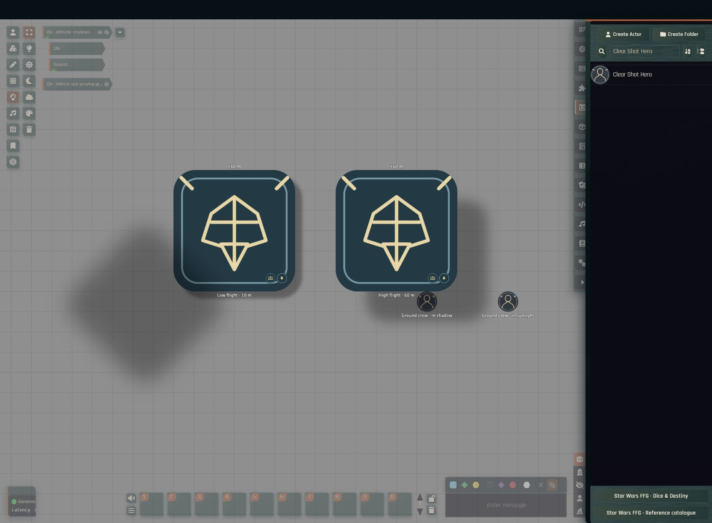

# Altitude shadows

Elevated actors and vehicles cast their artwork silhouettes onto visible level surfaces and lower actors. A ship on a native Foundry Sky level can cast onto Ground even when its own token is absent from that view. Hidden, invisible and embarked actors do not cast shadows.

The GM opens **Star Wars FFG · Range bands → Altitude shadows** in the left scene controls. Each scene stores its direction, sun height, feathering, opacity and altitude scaling. Each client can disable rendering through **Configure Settings → Star Wars FFG → Show altitude shadows**.

## Height and softness

Logarithmic scaling is the default. It uses the actual height above each receiving surface, compressed as `reference × log(1 + height / reference)`. The reference defaults to 50 scene distance units. Lower reference heights compress more; Linear remains available. The setting changes only the appearance of shadows, never elevations, combat distances, firing arcs or dice pools.

A larger height gap increases both displacement in the chosen direction and feathering. The same ship therefore casts a tighter shadow on a raised vehicle than on the ground. At orbital heights, logarithmic growth avoids the extreme offsets of linear projection. This is a stylized cue, not an astronomical lighting simulation.

## Receiving surfaces

- A level uses its native base height unless the GM supplies a surface-height override. Turn off **Viewed level receives shadows** for open sky or empty space. This disables its flat plane; lower actors can still receive shadows.
- A visible actor receives shadows at its elevation plus native token depth, converted from grid spaces into scene distance units. Configure token depth if its top height needs adjustment.
- Actor shadows are clipped to the receiving artwork's transparency, including rounded badges and custom portraits. They follow movement, rotation, scaling and flipping. Names, status icons and interface controls remain unshaded.
- A token cannot shade itself or an actor above its casting elevation. The ground and each lower actor are calculated independently.

These are flat receiving planes and artwork masks. The feature does not trace roofs, terrain contours, building walls or intervening hulls as 3D shadow occluders, and it does not grant mechanical darkness, concealment or cover. It needs no Director of Realms module.

## Rendering and verification

Updates follow document and canvas events, coalesced into one animation frame, without an idle timer. Movement reuses the baked silhouette; artwork, size or height changes rebuild it. Each shadow raster is bounded to 512 × 512 pixels. Receiver masks are shared, unused overlap rasters are released, and teardown destroys only owned textures, preserving Foundry's source-art cache.

Local regression tests cover cross-level projection, logarithmic growth through 100,000 distance units, receiver heights, mask placement, movement reuse, concealment, leaving and re-entering a shadow, cleanup and asynchronous teardown. Live standalone Foundry acceptance and its limitations are recorded in [validation](validation.md).

