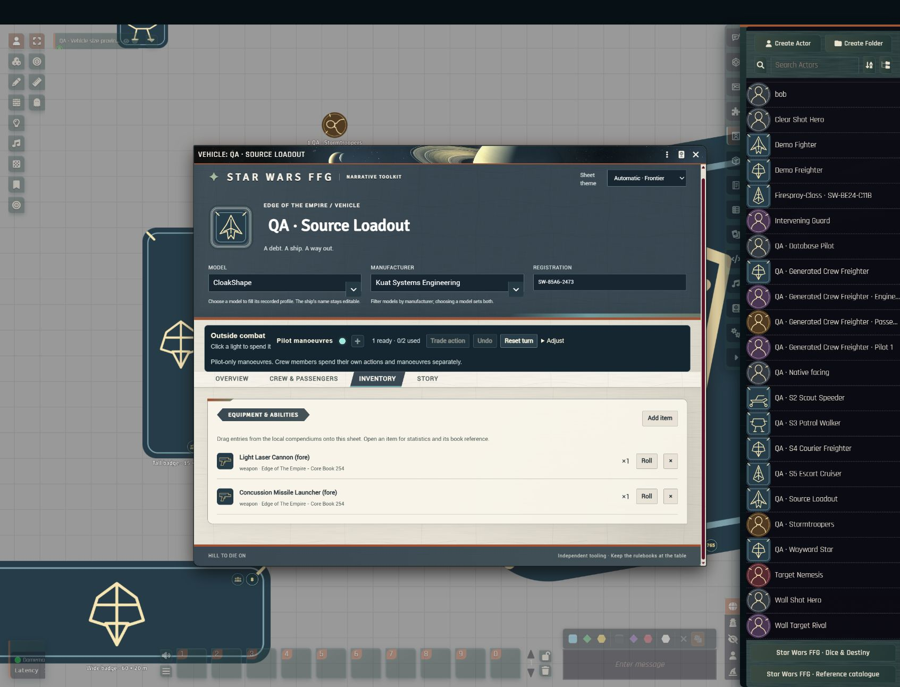

# Database enrichment

The canonical public catalogue is `data/reference-database.json`. Both the Foundry bundle and the sw-rpg.info catalogue are generated from it. The original Access database and SQL backup are not rewritten. Public additions contain bounded mechanical values, names and book/page references; scans, artwork, source prose and private paths remain outside the public catalogue and package.

## Current coverage

| Area | Recorded coverage | Remaining work |
| --- | --- | --- |
| Original database | All 6,662 rows and 44 original tables retained | Enrichment does not imply that every sourcebook rule is encoded |
| Vehicle numeric profiles | 312 of 399 complete profiles; evidence distinguishes structured matches, aliases and printed-page checks | 87 incomplete profiles remain in the [vehicle source register](vehicle-source-coverage.md) |
| Installed weapons and systems | 152 same-source records; 11 checked against printed pages, including 3 unarmed models | 141 structured candidates need page comparison; 247 vehicles lack a usable complete candidate at their exact cited source |
| Searchable mount relationships | 288 rows in `vehicle_loadouts`; catalogue totals 45 tables / 6,950 rows | Candidate rows are labelled and excluded from automatic equipment |
| Native Foundry library | 4,495 Items, 399 vehicle Actors, 1,701 Journals | Checked weapons are embedded in the matching vehicle, not added as extra top-level Items |

The 312 numeric profiles are not 312 new printed-page reviews. Their existing evidence comprises 221 exact structured matches, 55 reviewed aliases and 36 held-page comparisons. Loadout status is a separate check. An unresolved loadout is not treated as unarmed, and an empty field is not proof that a component is absent.

## First checked loadout batch

All entries below retain their existing **Edge of the Empire core book** identity. Page numbers are printed book pages; a weapon block continued on a following page keeps that actual page on its Item.

| Vehicle | Checked pages | Standard mount records |
| --- | --- | --- |
| Airspeeder | 248 | Unarmed |
| A-A5 Heavy Speeder Truck | 250 | Unarmed |
| Personnel Carrier | 252 | Unarmed |
| AT-PT | 252-253 | Blaster cannon; personal-scale grenade launcher |
| AT-EST | 253 | Blaster cannon |
| CloakShape Fighter | 254 | Laser cannon; concussion missiles |
| GAT-12h Skipray Blastboat | 259 | Ion cannon; laser cannon; proton torpedoes; concussion missiles |
| ILH-KK Citadel-class Light Freighter | 260-261 | Laser cannon; port/starboard ion cannons; missiles; tractor beam |
| Space Master Medium Transport | 262-263 | Dorsal and ventral laser cannons |
| Starwind Pleasure Yacht | 263 | Dorsal and ventral laser cannons |
| Star Galleon-class Armed Transport | 265 | Port/starboard turbolaser batteries; concussion missiles |

Mount count and the Linked quality are separate fields. A mount's personal/vehicle damage scale is explicit. Missing ammunition quantities are not invented. Sensors, hyperdrives, navigation, consumables, crew, passengers and cargo are copied only where the checked block states an unambiguous value. Existing variable capacities are not silently replaced with a guessed exact capacity.

A spot check of the held YT-1300 core-book page exposed differences in the structured dataset's crew complement and sensors. The catalogue's YT-1300 entry cites **Starships and Speeders**, whose corresponding page has not been checked here, so an alternate book's profile is not silently substituted. Source identity and review status must agree before automatic equipment is enabled.

## Further extraction targets

The audit also found these useful next targets. These are data gaps or review queues, not a claim that all such pages are missing from the held collection.

- The 610 allies/adversaries references need full mechanical stat blocks to support native NPC creation from those entries.
- Of 174 species records, 104 have complete creation statistics. The remaining 70 need classification: some may be reference entries rather than playable species. Do not invent player-character profiles for them.
- The 38 standalone vehicle-weapon records include 28 blank skill fields. A software default of Gunnery is not source verification.
- Personal weapons include four missing damage/skill values, five missing ranges and eleven missing encumbrances. Gear has three missing prices, six missing encumbrances and three missing rarities.
- Twelve of 618 talent references lack activation metadata. Talent conditions, Force power effects and signature mechanics require their own verified rules coverage; weapon extraction does not supply it.
- Installed components, attachments, repair effects, weapon fire restrictions and special actions still need evidence and automation beyond the fields in this batch.

The held **Cyphers and Masks** scan omits printed pages 36-69, including the vehicle candidate at page 61. That exact request is included in `data/source-requests.json`. No held scanned page has been added to the public repository.

## Reproduction and review

```powershell
npm run publish:vehicles -- "path/to/first/dataset" "path/to/second/dataset"
npm run publish:loadouts -- "path/to/first/dataset" "path/to/second/dataset" --reviews ".local/vehicle-loadout-reviews.json"
npm run publish:database -- "path/to/creator-database.sql"
npm run check
npm test
```

Keep the reviewed overrides in the ignored `.local` folder. Preserve them when regenerating: dataset candidates alone cannot reproduce printed-page review decisions. `publish:loadouts` emits the bounded `data/vehicle-loadouts.json` and a private pending list at `.local/vehicle-loadout-pending.json`. Conflicting datasets, absent weapon values or a different cited book/page prevent an automatic match. The public validator rejects unknown keys, prose, private paths and invalid mechanical values.

For the website, run `data:build` against this canonical database, then the catalogue freshness and Foundry interchange checks. Website deployment is a separate step through its reviewed `dev` to `staging` to `main` flow; changing these local files does not update the public site.

The first website sync is prepared in [sw-rpg-info PR #9](https://github.com/JoelBondoux/sw-rpg-info/pull/9), commit `6bbfaaa218946a1ae367148d7b687d67146ab13d`. Only the eight catalogue/export files are included; unrelated website changes remain in their working tree. Its isolated snapshot passes catalogue structure/freshness, both TypeScript checks, the production build, and 185 tests across 36 files (two skipped). The explicit Foundry run passes seven tests, including all 11 checked vehicle exports; one pre-existing all-entity contract test remains skipped. This does not claim full website-to-Foundry coverage.

The public site has not been deployed by this change. The website's `CONTRIBUTING.md` requires that "a person reviews an immutable same-repository pull-request SHA before dispatching it to the self-hosted runner." That manual review and protected promotion remain outstanding; no hosted status has been claimed.

## Verification for this batch

The system's 286 automated tests pass. They include strict loadout validation, source identity, candidate exclusion, same-model idempotence, preservation of custom equipment, failure rollback and enrichment of older empty compendium references. Website field mappings are checked against the same data rather than a separate handwritten vehicle list.

Live in Foundry 14.368 with no modules: choosing the CloakShape model populated its two weapons; the laser's damage, critical value, range, scale, quality and equipped state matched the checked profile. Re-selecting the model kept exactly two mounts. Changing to the checked unarmed Airspeeder removed those untouched defaults and cleared old component values while retaining the custom vehicle name and registration. Older compendium loadout upgrades have automated coverage but have not received a separate live import test in this batch.


