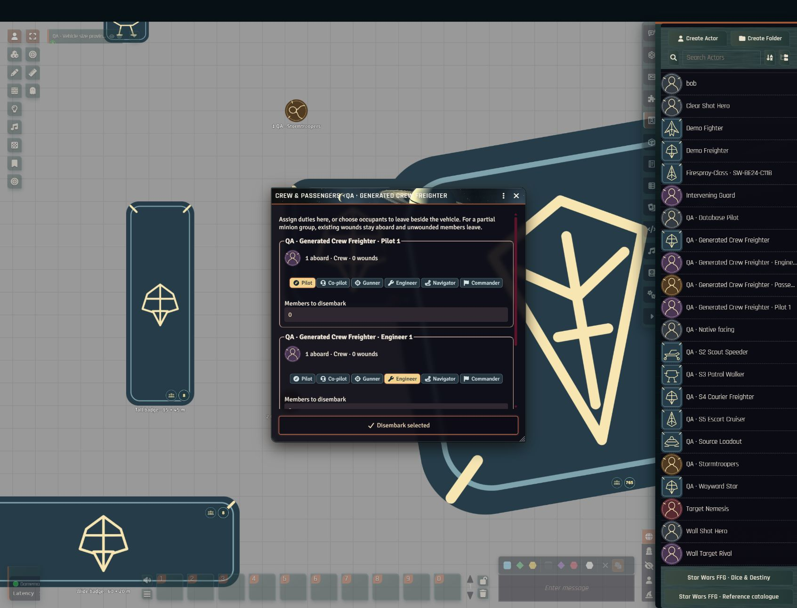

# Validation

## 2026-09-29 onboarding, settings and wiki

The 0.4.1 candidate has pure-model and browser regressions for book persistence, explicit future-world reuse, storage denial, stale edits, player permission rejection, search preserving selection, narrow layout and native settings grouping without losing input listeners. Isolated Foundry 14.368 with no modules verifies the new-world core-tour handover, GM/player welcome separation, book and skip persistence after reload, six native settings groups, seven tour steps including a hidden-tray fallback, journal presentation, compact sheet resizing/skill-pool access and NASA artwork in the new-world welcome scene. Private native results and screenshots stay under ignored `.local/onboarding-native/`. The public wiki has ten original guides plus navigation, with candidate features labelled. See [onboarding details](onboarding-settings.md).

## 2026-09-29 book play guidance and adventure seeds

Page images confirmed two book-specific adventure guidance sections and the Spy reward discussion cited in [book play guidance](book-play-guidance.md). The GM-only DoR adapter returns phase-labelled planning prompts, reward decision points and paginated catalogue seeds through the owned-book filter. Reward amounts remain unset and no state change is applied. The creator catalogue contains 421 cited seeds across 17 books; 78 have no hook description. The local section finder flagged 78 further candidate pages. All 2,052 low-text pages in the preferred-source pass have received local vision triage; 569 were flagged as possible adventure guidance and 61 as possible reward guidance. These candidate matches are not verified guidance.

All **395 `.test.mjs` Node tests** pass locally, including GM-only access, book filtering, separate same-name seed records and reward non-automation. Syntax/template/data checks and the **286-file public package build** pass. The user-level npm shim was unavailable, so the equivalent Node commands were run directly. No live Foundry/DoR adventure run or hosted CI was performed for this addition.

## 2026-09-29 isolated Director of Realms integration

The native adapter now refuses targeted execution for blocked, unknown or unverified paths, including `requiresGmRuling` with otherwise clear sight. It binds the measured source to the rolled actor's full identity, and binds a vehicle's assigned-crew lookup to that vehicle instance. Unsupported weapon, arc and spending decisions still use the established explicit GM workflow.

Red-first regressions and all **374 Node tests** pass, including seven adapter tests. Syntax/template/data checks and the **274-file package build** pass. A separate reproducible DoR **0.10.1219** production build from `f28cb4a` passed eight focused suites / 25 tests with one worker; its full suite was not run.

In isolated Foundry **14.368**, GM and two player clients parsed one genuine roll identically: Negotiation, 4 net successes, 1 Advantage, pool 2 Ability / 2 Proficiency / 1 Difficulty. DoR's model-manager prompt received the exact facts, actor and skill. The final adapter was separately reloaded and checked with native token documents and instrumented execution boundaries, with unsafe paths and unrelated actors rejected and a clear positive control accepted. Both checks had zero JavaScript page errors.

DoR Studio also extracted 25 candidates from a held PDF, queued 23 for review and persisted one GM approval after reopening. Images and campaign evidence stayed in the private world. Derivative image generation and Surveyor acceptance remain open because no configured image endpoint answered. Narration was refused during the frame-pressure recovery hold; a read-only foreground observation subsequently recovered to green at 40 seconds. No compatible already-loaded narrative provider was available under the current configuration, so no actual inference followed and all four full campaign scenarios remain open. See [the exact build hashes, native checks and remaining acceptance](dor-acceptance.md). Shared Foundry and concurrent model workloads were not modified.

## 2026-09-29 altitude shadows across levels and actors

Elevated artwork now casts onto visible native level planes and lower actor artwork. Each receiving actor uses its elevation plus native token depth; a shared alpha mask clips the shadow to its portrait. Default logarithmic height scaling increases offset and feathering with diminishing growth, while keeping stored elevation and combat measurements unchanged. Scene controls expose lighting, scaling and level-surface overrides, and clients can disable the feature.

Red-first regressions covered projection, logarithmic growth and receiving actors. A further failing regression demonstrated retained rasters after a receiver moved away; those rasters are now released, while the cached source remains available for re-entry. All **371 Node tests** and syntax/template/data checks pass locally. The ten shadow tests cover receiving heights, 100,000-unit altitude, cross-level sources, rotation and flips, concealment, bounded allocations, movement reuse, asynchronous teardown and cleanup. The user-level npm shim was unavailable in this shell, so the package scripts were invoked directly with their equivalent Node commands. Release packaging was also checked locally; no hosted CI or DoR campaign ran for this feature.

Live acceptance used standalone Foundry **14.368**, system **0.3.0**, with **zero active modules**, in the dedicated **QA · Altitude shadows** scene without changing the active player scene. Ships at 10 m and 60 m showed different offsets and softness. A rotated 150 m ship on Sky cast onto Ground while its own token was absent from that view, also shading part of the lower ship's artwork. A ground character moved through the high ship's projection and darkened, with an identical character outside it remaining bright. Names and controls remained unshaded. Disabling the Sky receiving plane removed the floating plane shadow while retaining cross-level projection onto Ground. Scene enable/disable and persisted settings were checked; the final browser warning/error log was empty. The visible FPS counter stayed around 59–60 after loading these five fixtures; this is not a large-scene performance benchmark or multiplayer/fog acceptance test.

Evidence: [ground and actor comparison](images/altitude-shadow-comparison-live.png), [Sky with receiving plane disabled](images/altitude-shadow-sky-live.png). See [configuration and limitations](altitude-shadows.md): these are flat planes and artwork masks, not terrain/roof occlusion or mechanical cover.

## 2026-09-29 action/manoeuvre elevation-label clearance

The turn strip now avoids native canvas elevation, level and name labels as well as HTML controls. Rendered PIXI bounds are converted to CSS coordinates, preserving clearance across camera zoom and display scale. Token refreshes coalesce into one frame, including nearby labels, and restore a selected token's strip after configuration temporarily hides it. There is no idle polling or work when nothing is selected.

Red-first regressions reproduced the missing canvas-label obstacles and the refresh/recreation gap. All **361 Node tests**, syntax/template/data checks and the **268-file package build** pass locally. Coverage includes nine camera/display-scale combinations, hidden/empty labels, neighboring labels, temporary token invisibility, deselection and HUD lifecycle.

Live acceptance in standalone Foundry 14.368, system 0.3.0, with zero active modules used `Tall badge · 15 × 45 m`: the MAN bar cleared +150 m, remained visible and clear after changing the height to +200 m, followed zoom-out/in, and avoided the open right-click HUD. Elevation was restored to 0; the final browser warning/error log was empty. Evidence: [height-label clearance](images/turn-elevation-clearance-live.png). This check did not run a DoR campaign or hosted CI.

## 2026-09-29 vehicle movement preserves facing

The native `preMoveToken` path disables the movement operation's `autoRotate` flag for vehicles before Foundry computes automatic bearing and movement animation. Explicit rotation changes and CW/CCW remain available. This applies independently of the automatic manoeuvre-spending setting; personal actors retain the core preference. No new per-vehicle rule exceptions are inferred.

All **360 Node tests**, syntax/template/data checks and the **267-file package build** pass locally. The final browser error log was empty.

A red-first test reproduced unwanted auto-facing through the registered movement hook, covering six travel directions across dragging, keyboard, API and undo methods, preserving waypoints and positions, and checking personal-token and manual-rotation positive controls. Live acceptance used Foundry 14.368 with zero active modules and **Automatic Token Rotation checked**. `Tall badge · 15 × 45 m` moved from (7800, 5500) to (8100, 5500), then reversed to (8100, 5600), retaining its 180° bearing. CW changed the bearing to 225°. The token was restored through its configuration to (7800, 5500), 180°. Evidence: [bearing after both moves](images/vehicle-move-preserves-facing-live.png). This was a standalone QA check, not a DoR campaign or hosted CI run.

## 2026-09-29 selected-token name and range caption

The range origin caption now sits below the actual rendered nameplate rather than an estimated artwork-relative position. Screen-to-world conversion accounts for camera zoom and UI scale, with at least 6 CSS pixels of clearance. Minion count/name visibility changes trigger one coalesced caption reflow, including when no band label is visible. Band labels and attack cards use the same measured name bounds as obstacles.

A red-first regression reproduced overlap at low zoom. All **359 Node tests** pass, including short/wrapped name heights, four camera scales, hidden names, rotated artwork and the actual overlay lifecycle after a late minion-name update. The lifecycle check also confirms no repeated work for unchanged names and no updates after teardown. Syntax/template/data checks pass locally.

Live acceptance in `QA · Nearest-edge ranges` confirmed separate lines for `1 QA · Stormtroopers` and `QA · Linked Patrol · Personal` while selected and after zoom-out/in. The active player scene was unchanged. No browser errors appeared. Evidence: [full scene](images/token-name-caption-clear-live.png), [caption detail](images/token-name-caption-clear-detail.png). No hosted CI or DoR campaign ran for this fix.

## 2026-09-29 action/manoeuvre HUD clearance

The canvas turn strip now measures visible token-HUD controls outside the token rectangle, including elevation, rotation and expanded palettes. Placement avoids those controls and other visible interface obstacles, preserves an 8 px gap when space permits and falls back within the viewport. Hidden palettes do not reserve space. Closing the HUD restores normal placement; pan/zoom and application movement queue a single frame update, with observers disconnected on teardown and no idle polling.

Red-first regressions reproduced the original overlap and the pan-event timing defect found during live testing. All **356 Node tests** pass, including HUD envelopes, hidden controls, zoom scales, viewport edges, competing windows, coalesced updates, HUD closure and teardown. Syntax/template/data checks and the 263-file package build pass locally. No hosted CI or DoR campaign was run for this fix.

Live acceptance in the standalone QA world checked the Clear Shot Hero and linked patrol HUDs. Zoom-in/out, expanded movement controls and the patrol's additional minion-group button all retained approximately 8 px clearance with zero measured overlap. Closing the patrol HUD returned the strip to its normal position; reopening moved it clear again. No JavaScript errors were reported; ordinary exhausted-manoeuvre notices were present in the console. Evidence: [token HUD](images/turn-hud-clear-live.png), [expanded movement palette](images/turn-hud-palette-clear-live.png).

## 2026-09-29 hull-corner zones and hidden-face rejection

Both canvas selectors now use hull-corner boundaries, with the same geometry driving firing eligibility, defensive endpoints and automatic pools. Fore/Aft no longer include side plating on a long hull. Corner rays extend outward at 45 degrees; native rotation is preserved. This is the requested canvas convention, documented separately from the core book's centre-based firing diagram.

The reported shot to a far Aft/Port corner exposed a second defect: corner contact alone was treated as access to both faces. Defensive validation now also requires the ray origin to lie outside the selected face. A tangent or rearward approach cannot select hidden shields. Red-first regressions reproduced both defects. The full suite passes **350 tests**, covering square/wide/long hulls, rotated corner rays, face approach, positive controls, and refusal to stage an invalid pool. Syntax/template/data checks and packaging pass locally; no hosted CI or DoR campaign ran for this follow-up.

Live acceptance reused `QA · Nearest-edge ranges` without moving tokens or changing the active player scene. The rotated attacker’s Starboard selection advanced to defence; the long target showed corner-anchored end wedges and labels clear of its central controls. Selecting the far-side Port face remained on step 3, highlighted red and reported no clear shot to that defensive zone. The exposed Aft face remained valid. No new browser warnings/errors appeared after reload. Evidence: [firing selection](images/vehicle-corner-firing-live.png), [rejected Port face](images/vehicle-port-face-rejected-live.png), [valid Aft face](images/vehicle-aft-face-valid-live.png).

The following earlier acceptance record predates this correction; its centre-sector geometry and 2.8 m Fore example are superseded by the hull-face approach checks above.

## 2026-09-29 targeting, arcs and canvas selection

The local Node suite passes **341 tests**, including red/green regressions for partial large-target visibility, clear-shot range changes, weapon arcs, exact shared 45-degree boundaries, defence-zone endpoints, assigned-gunner ranking, missing weapons, stale target shields and the on-token selection state machine. Syntax/template/data checks and the release build pass separately. The build contains 256 public files. These are local results; this follow-up did not run hosted CI or a Director of Realms campaign.

Live UI acceptance ran in Foundry **14.368**, system **0.3.0**, with **zero active modules**. The GM viewed `QA · Nearest-edge ranges` without activating it for players. A blocked nearest point on the large vehicle was replaced by a clear 6.4 m path past the patrol; the personal sheet agreed with that measured band. A dedicated GAT-12H vehicle fixture used its source-backed mounted weapons and two generated gunners. Auto selected the stronger gunner and a usable dorsal turret arc instead of the more powerful forward launcher pointing away. An explicit novice selection reduced three Proficiency plus one Ability to one Proficiency plus one Ability, and the exact pool staged beside chat without rolling.

The final canvas flow was exercised through native pointer clicks and keyboard focus/Enter (the same preview handler as pointer entry):

- Four true 90-degree hull sectors and the smaller central Up/Down mount sections appeared over the attacker. A blocked forward arc stayed on step 2; Up selected the recorded dorsal turret.
- Selecting Starboard advanced to the target's four shield zones. Up/Down were disabled on defence rather than assigned invented shield values. Cancel returned to the prior attack.
- Previewing the target's Fore zone moved the endpoint to its exposed sector boundary, changing the shot from 2.0 m to 2.8 m. Fore defence 2 added two Setback dice. This exact attacker/defender sector-boundary case first failed live, was reproduced in a failing unit test, and passed after analytic boundary candidates and numerical tolerance were added.
- The far-side Port zone reported no clear shot and could not be committed. A pointer click on the valid Fore section closed the picker and retained the confirmed arc/zone. Sending the card to the tray staged one Ability, three Proficiency, three Difficulty and two Setback without rolling.

Screenshots: [attacker selection](images/vehicle-arc-hover-live.png), [defensive-zone preview](images/vehicle-defence-hover-live.png), [confirmed pool](images/vehicle-arc-pool-live.png), [explicit novice pool](images/vehicle-manual-pool-live.png), [large-target clear shot](images/range-clear-shot-live.png). The older [options screenshot](images/vehicle-attack-choice-live.png) records the optional detailed selection path; the canvas picker is now the primary path.

The log review also identified an off-canvas crew visibility error during scene loading. A getter-only TokenDocument reproduced it; the display mask now operates only on an actual canvas token, preserving off-canvas documents and crew membership. Its regression and the existing on-canvas masking test both pass. A final live reload produced no new browser warnings or errors. During the completed arc interactions, the visible counter was 59–60 FPS; this was a bounded UI check, not a sustained performance benchmark.

Limits of that earlier arc test: the outline search is bounded and can miss a very narrow unsampled gap; cover remains a GM decision. Ranking uses expected raw impact before armour, qualities, ammunition expenditure or optional symbol spends. That run used two-dimensional wall checks and did not test separate player clients. The later [layered-flight acceptance](layered-flight.md) adds native level walls/surfaces, crew transfers and independent GM/two-player verification; ambiguous geometry still requires a GM ruling.

## Creation, minion groups and nearest-footprint range (2026-09-28)

The working tree passes **305 Node tests**, the syntax/template/manifest/data check, and the public package build. Focused tests were added red first for new geometry, creation and minion behavior. Integration tests exercise actual actor damage and skill-rank methods, roll rejection for an inactive group, combat batch deduplication, and the authoritative movement/turn hooks. These are local results; this candidate has not been committed, pushed or promoted through protected CI.

Live browser checks ran in **Foundry 14.368**, system 0.3.0, in the standalone QA world with **zero add-on modules**. The new GM-viewed scene did not replace the existing active scene.

- Nearest range: a 4 × 10 m vehicle at 45 degrees measured about 5 m to its closest corner, giving Short / one difficulty die. The same centres with the hull straight measured 7.5 m, giving Medium / two difficulty dice. The attack trace used the corresponding nearest points. Unit cases also cover crossed hulls, containment and expanded rotated outlines.
- Guided player: Pilot / heavy weapons / Agility / non-Force preferences narrowed the actual catalogue. Human, Smuggler and Pilot populated free ranks and native statistics. A 120-XP overspend disabled confirmation; a legal 80-XP allocation left 30 of 110 XP. Starting funds applied once. Ready for play rejected the outstanding species-source review, which was intentionally not falsely signed off.
- Manual player: Human / Consular / Healer selected Force and Destiny creation rules and required three career plus two specialization ranks. An empty choice disabled continuation; valid choices enabled it. Cancelling at equipment left species/career blank, XP at zero, no specialization and no advancement purchases.
- Enemy guide: an original three-member Human infiltrator preset populated its minion sheet and four trained group skills. Species exceptions and equipment remained explicitly pending review.
- Linked patrol: three healthy tokens produced two animated connections and trained rank 2. Eleven wounds against threshold 10 produced two active members, one connection and rank 1. Thirty-one wounds produced no active members or connections. Healing to zero restored all three. Reload preserved membership. The live Ranged (Heavy) builder changed from two proficiency dice to one proficiency plus one ability after a casualty.
- Shared movement: in a separate QA combat, each of three members moved once while the sheet recorded only one spent group manoeuvre. The group retained a single combat slot. Automated checks additionally cover movement replay, exhausted budgets, temporary unavailability, hidden-member visibility and deletion reconciliation.

Screenshots: [rotated corner](images/range-nearest-corner-live.png), [straight hull](images/range-nearest-edge-straight-live.png), [guided origins](images/character-guide-origins-live.png), [created character](images/character-guide-created-live.png), [wounded group pool](images/minion-group-pool-live.png), [restored links](images/minion-links-detail-live.png).

This is not a full adventure acceptance test, an assertion of complete expansion-rule automation, or a live DoR test. Species exceptions still need source review; the enemy guide produces editable original presets; established linked groups do not yet split or merge or distribute members among vehicle crew stations. See [creation](character-creation.md) and [minion groups](minion-groups.md).

## Current crew and vehicle enrichment checks

The 2026-09-28 working tree passes **286 Node tests**, including crew generation, actual token-actor sheet resolution, vehicle loadout validation and application, and compendium loadout upgrades. This extends the earlier evidence below; it is local validation, not a protected-branch or deployment claim.

In the standalone Foundry 14.368 QA world with zero modules, crew generation created a pilot, engineer and two passengers from a preview, placed them aboard the intended vehicle, and retained all four occupants after reload without duplicates. The pilot supplied the actual piloting pool. Double-clicking the Crew & Passengers row and the compact manager portrait opened that occupant's synthetic character sheet without changing the roster. The manager remains resizable with an independently scrolling roster and fixed disembark button.

The same world also verified model selection with checked weapons, same-model re-selection without duplication, and changing to a checked unarmed vehicle. See [database enrichment](database-enrichment.md) for exact source coverage and remaining checks. The complete original 44-table database is retained; the enriched catalogue contains 45 tables and 6,950 rows, with 288 additional mount relationships. Candidate mount rows are labelled and never equipped automatically.

## Earlier automated evidence

The 266-test suite covers dice distributions and persisted term compatibility, distinct chat-die silhouettes, WCAG AA theme tokens, database-backed and fuzzy character origins, origin locking, all three rule lines' starting resources and equipment budgets, both public interchange versions and transport limits, connector isolation, reviewed community-rule preservation and replacement, community-rule safety, library upgrades, public advancement and vehicle publishing/merging, procedural actor art and role palettes, portrait-to-token synchronization with custom-art preservation, silhouette-based vehicle footprints, action/manoeuvre allowances, strain purchases, player-management policy, idempotent movement spending, combat round persistence, failed-roll and initiative exclusions, concurrent turn spending, native HUD rotation, copyright boundaries, artwork-credit Journal idempotency, complete native narrative-roll facts, strict native-message recognition, cancellation, upgrades, Force resources, unlimited custom skills, grouped and alphabetical skill layouts, automatic and manual theme resolution, structured motivations, signature attachment/unlock paths, talent-rule validation and stacking, source-verification metadata, fail-closed DoR rules evidence, minion thresholds, damage, initiative, XP paths, per-actor transaction serialization, all three range scales, scene-and-attacker scale resolution, map and Theatre-of-the-Mind range profiles, scale-specific calibration, edge-to-edge character and vehicle ranges, expanded footprint outlines, edge-based ToM calibration, scaled-map elevation, wall and visible-token obstruction detection, single/multi-origin selection, furthest-corner range-label alignment, token/tile repulsion, viewport-aware animation and edge fallbacks, animated attack traces, combat-card obstacle avoidance and V14 viewport bounds, dice-tray transfer and ownership guards, combat range automation, public/DoR range services, SQL parsing, complete database coverage, formatted prices, owned-book filtering, Group context, private source conversion, authenticated encryption and player access guards.

`npm run check` checks syntax, Handlebars templates, manifest paths, version consistency, and all 64 dice image sizes. `npm run build` uses a release allow-list.

Crew coverage adds 24 checks across the crew, Foundry and targeting suites: capacities and ownership, simultaneous last-seat requests, persisted token attachment, minion split conservation and rollback, real assigned skills and handling, silhouette-based vehicle attacks, hidden-member redaction, compact pilot representation, read-only occupants, zoom/viewport containment including rotated hulls, crew combat budgets and Foundry 14 roll visibility. Regression cases first failed for the destination used during drag animation, rotated-corner overflow, missing aggregate-roster support, zoom/edge placement, embarked crew blocking the GM's targeting line and vehicles inventing an unarmed attack. The corresponding fixes pass.

## Live acceptance register

| Check                                        | Status                                                                                                                                                                              |
| -------------------------------------------- | ----------------------------------------------------------------------------------------------------------------------------------------------------------------------------------- |
| Foundry 14.368 boot and sheets               | Passed in an isolated licensed world for character, vehicle, minion, rival, nemesis and Group                                                                                       |
| Dice So Nice 6.3.1                           | Passed in Foundry 14.368 with concurrent GM and player clients: one public pool animated all seven custom dice on both screens, retained the intended d6/d8/d12 geometry and colors, kept the revised Ability and vertically stacked Difficulty glyphs within the d8 faces during motion and at rest, and produced the same seven-term chat result for both users. No dice-related browser errors were recorded |
| Local database import into world compendiums | Passed: 4,495 Items, 399 vehicles, 1,701 reference journals; repeat import preserves existing entries. A current-checkout upgrade in isolated Foundry with DoR 0.10.1162 preserved all documents, enriched 171 Items and 151 vehicle Actors, and changed the held-page `610-AVA "Dart" Speeder Bike` from seven zero placeholders to its exact reviewed profile without overwriting identity or source reference |
| SW Adversaries file import                   | Passed through the Foundry menu: 1,345 NPCs, 51 vehicles and 2,309 source notes; repeat import preserved all records                                                                |
| Complete public database                     | All 44 tables / 6,662 rows match the supplied SQL fields and null values; all 6,595 native documents pass Foundry model validation                                                  |
| Public advancement catalogue                 | 135 specialization entries and 38 signature entries validate; 173 graphs / 3,042 nodes merge into the exact public Item identities; source prose, description fields, artwork and private/PDF paths are absent. The separate evidence manifest records 168 full-chart comparisons and 5 pending comparisons |
| Public vehicle profiles                      | 312 of 399 vehicle Actors have complete evidence-backed numeric profiles: 221 exact structured matches, 55 reviewed aliases and 36 held-page comparisons. All seven fields validate and merge only into exact native identities; 87 unresolved records remain explicitly incomplete. Public data contains no descriptions, artwork, PDF/XML names or private paths |
| Artwork attribution                          | Passed in isolated Foundry 14.368: the fixed **Star Wars FFG · Artwork credits** Journal was created once, opened from the Journal sidebar and showed the bundled image, NASA Goddard and Dan Gallagher attribution, NASA source and usage links. Automated checks also verify Observer ownership, GM-only creation, fixed identity and preservation of edits |
| GM source confidentiality                    | All 2,309 source records encrypted before storage; direct document reads contain ciphertext and placeholder pages; fresh GM browser stays locked without its key                    |
| GM key backup / restore                      | Passed through the Foundry menus in a fresh browser, including download round trip and decrypted source reader                                                                      |
| New encrypted source import                  | Native NPC and new encrypted note created; GM context recovered prose; persisted document contained no plaintext marker                                                             |
| Bundled interface fonts                      | Roboto, Signika and Rajdhani loaded from local assets; computed sheet, long-form and interface fonts verified in Chromium                                                            |
| Print-inspired sheets and theme mapping      | Passed for Edge/Frontier, Age/Rebellion and Force/Mystic in automatic mode; per-sheet and client-wide overrides, original paper texture, vehicle/Group campaign mapping and zero browser errors verified |
| Optional Foundry interface theme             | Passed for Frontier, Rebellion and Mystic across the lossless public-domain Saturn and Enceladus artist's concept, six custom navigation icons, pause mark, chat, populated combat tracker, windows, journals/handouts, scene controls, players and hotbar; automatic selection, manual overrides, Foundry-default opt-out, local asset loading and zero page errors verified |
| Chat dice shapes and theme contrast          | Automated checks pass all three themes at WCAG 2.1 AA text contrast and verify seven semantic dice classes with square, diamond and strongly faceted d12 silhouettes; refreshed Foundry visual acceptance recorded with the current build |
| Procedural actor art and vehicle footprints   | Passed pure tests and live Foundry 14.368 acceptance. Chromium rendered and measured all 24 character and 20 vehicle families at 64 pixels; all 173 species and 399 vehicle records across 110 hull labels resolved without fallbacks, every character head/body pair shared its centreline and every glyph stayed within its protected frame. After a live world reload, existing placed tokens using Foundry defaults migrated to the same portrait shown in the Actor directory and sheet: characters remained circular, vehicles remained square with upper-corner facing marks and retained their larger boardable footprints. Explicit custom portrait and token-art preservation is covered by regression tests. The canvas held 59 FPS and emitted no browser warnings or errors |
| Public integration API                       | Passed with the current build: version-one compatibility and version-two character, minion, rival, nemesis, vehicle, Group and rule-pack imports; direct-link review; same-key preservation by default; explicit in-place replacement; player-readable community rules; exact-origin one-package isolation against a spoofed second origin; and concurrent GM/player permission behavior. The player client could browse imported rules, while character creation correctly stopped because that Foundry role lacked `ACTOR_CREATE` and GM-only Actor/rule imports remained unavailable |
| Interactive advancement                      | Passed: two trees, paid additional specialization, blocked duplicate, mouse talent purchase, XP deduction, shared unranked traversal, resource effect and reload persistence        |
| Talent guidance and automatic pools          | Passed: 2,700 private node summaries validated; existing compendiums enriched additively; learned Command changed both the visual pool and `actor.rollSkill`; DoR received the same rule and no browser errors |
| Signature abilities and motivations          | Passed: 38 native signature references imported, 36 private graphs validated, matching bottom-row link enforced, base plus upgrade purchased for 40 XP, two structured motivations rendered and DoR received active/dormant guidance; no browser errors |
| Glanceable and custom skills                 | Passed: 35 standard skills plus eight custom skills rendered across three columns without horizontal or vertical overflow; Grouped/A–Z switching, per-user persistence, add/edit/remove, XP, minion rank and DoR context passed; add remains unlimited |
| Ordinary Foundry dice coexistence            | Passed: d20, d100, coin and Fate retain their native terms                                                                                                                          |
| DoR installed provider discovery             | Passed in a separate Foundry 14.368 data path with Star Wars FFG 0.2.1 and DoR 0.10.1162 from PR #452: the module and runtime API both reported 0.10.1162 and the complete system-native adapter was exposed. A real Nara Vex Negotiation pool of 2 Ability, 2 Proficiency and 1 Difficulty produced 2 net success and 4 uncancelled Advantage. DoR accepted and classified the follow-up, then correctly failed closed before narration because Foundry p95 frame time reached 200 ms and no pressure-safe model was available. Live merged-build multi-client narration remains pending |
| Three beginner PDF source intake             | Passed after private text preparation: Edge 132 pages (OCR), Age 132 pages, Force 130 pages; 128 DoR text passages total, content review still pending                              |
| Three beginner adventures with automated GM  | Still pending. In the isolated 0.10.1162 world, `llama3.2:3b` completed a nine-token DoR connectivity request in 50.68 seconds after the unavailable ComfyUI image provider was disabled. A real full-turn request then failed closed under red Foundry frame pressure. This proves provider connectivity and resource protection, not narration quality or a completed play-through |
| Mixed-ruleline campaign and progression      | Pure-rule tests and native prompt facts passed; live campaign play pending                                                                                                          |
| Character origin workflow                    | Passed in isolated Foundry 14.368: all three GM rulesets selected by default; fuzzy `twi lek` and `bhuntr` searches resolved valid records; Twi'lek populated all base characteristics, soak and thresholds; Bounty Hunter marked its eight career skills; source-derived Edge creation and valid specialization/free-rank completion locked Species and Career. No Star Wars system browser errors were recorded |
| Starting resources and equipment             | Passed in isolated Foundry 14.368: an Edge character selected the +1,000-credit / +5-Obligation benefit, bought a 25-credit Stimpack through the owned-book-filtered picker, retained 1,475 credits, gained a native inventory Item, locked Species/Career, and then recorded a one-time `1d100 = 43` pocket-money chat roll that raised credits to 1,518 and removed the action. No Star Wars system browser errors were recorded |
| Shared book filtering                        | Passed with GM and player browsers: 6,662 rows with all books, 530 for Edge core, zero for an empty owned selection; direct detail lookup and open results refreshed                |
| Group sheet                                  | Passed: member add/edit, linked-character sync, preserved inaccessible links, shared ownership editing, shared Destiny updates, totals and reload persistence                       |
| Combat range overlay                         | Passed in isolated Foundry 14.368 with Dice So Nice 6.3.1: dedicated scene controls, Personal/Ship/Battlefield scales, single and multi-origin selection, colour bands, live scale switching and character-sheet/public/DoR range agreement. A 10 m grid measured the test pair at 50 m; the duplicated gridless scene used a pointer-set Close radius, persisted it through logout/rejoin, classified the pair as Short, and did not affect the scaled map. A current-checkout follow-up with installed DoR 0.10.1147 measured 5 m horizontally plus 12 m elevation as 13 m / Medium, reported a sight wall as blocked, disabled Auto while preserving the prefilled Manual pool, then reported clear and re-enabled Auto after the target moved around the wall. A clean-world follow-up selected Demo Freighter on the Personal-context test scene: the visible origin changed from Personal to Ship / vehicle / space, the target trace classified Demo Fighter at Close, and switching scale introduced no browser error. No Star Wars system browser errors were recorded |
| Combat range assistant                       | Passed in a fresh Foundry 14.368 world with no add-on modules active. Five exercises created 23 combatants plus one Group across a duel, four-player skirmish, battlefield vehicle engagement, mixed-ship engagement and character/vehicle boarding scene. Character, minion, rival, nemesis, vehicle and Group sheets rendered, persisted edits and exposed embedded weapons. Personal, Battlefield and Ship scales classified Engaged through Long targets; elevation, sight-wall blocking, combat-tracker badges, automatic scale inference, explicit mixed-scene scale, turn following and combat cleanup all passed. A current visible-browser follow-up aligned the Short label on the ray to the furthest unobscured corner while the Engaged label independently moved around its arc to clear the origin token. Camera reflow remained animated, the live counter held 59-60 FPS and no browser errors were recorded |
| Animated attack traces                       | Passed in the visible in-app browser and a fresh Foundry 14.368 world with no add-on modules active. Seven samples across the two-second animation increased monotonically while the card stayed hidden, then exposed the card only at progress 1. A clear 10 m Personal-scale shot was Medium, entirely solid and built 1 Ability, 2 Proficiency, 1 Difficulty, 1 Challenge and 1 Setback. The card sends those dice to the compact tray for adjustment before rolling; loading another attack replaces the staged pool while retaining its actor, weapon and applied-rule context. An intervening token split the trace at progress 0.454 and a wall at 0.6, with solid-before/dotted-after rendering and blocked cards that could not send dice. The Ship/vehicle pass classified 9.5 m as Close and asked for a gunner instead of inventing a pool. A Personal-scale edge-origin pass kept Engaged and Short labels inside the visible canvas. No browser errors were recorded |
| Player and trusted-player source access      | Passed: no GM controls or browser key; source helpers deny access; direct source-document reads reveal no prose                                                                     |
| Concurrent XP changes                        | Passed in isolated Foundry 14.368 with one GM and two simultaneous player clients. Both owners tried to buy Athletics from the same 10-XP actor: the GM-authoritative per-actor queue accepted one 5-XP purchase, rejected the stale second purchase, and left rank 1, 5 XP and exactly one ledger entry. No browser errors were recorded |

Never treat a unit test or preview as proof of a completed adventure playtest.

The 2026-09-28 artwork follow-up passed in the isolated Foundry 14.368 world without DoR: a newly created character placed upright, and dragging it east turned its head and facing tags east. The existing vehicle badges rendered sharply without the displaced duplicate frame. Browser warning/error capture was empty. The icon audit decoded 512-pixel character and 2048-pixel vehicle SVG sources and checked the vehicle tags against the inner-ring midpoint and outer edge. Regression tests cover all eight movement directions for characters and vehicles, unchanged document bearings, preserved custom token art and rotation locks. DoR's native-rotation compatibility was checked in source; this follow-up was not a live DoR campaign test.

The 2026-09-28 turn-control follow-up passed in the isolated Foundry 14.368 world with zero modules active. QA Native facing entered combat and rolled initiative without spending its action. A committed drag spent one manoeuvre; the plus control charged two strain and added an available temporary light, visible on both the selected token and sheet. Cancelling the Athletics builder left the action available; completing the check spent it on both displays. Advancing to round two restored allowances, rewinding restored round-one expenditure, and deselecting the token removed the canvas strip while retaining the sheet strip. The CW and CCW HUD buttons rotated the token without spending resources. Both management-policy choices saved and persisted after reopening; GM / automatic only was restored. The live counter stayed at 59–60 FPS and no browser errors were recorded. Foundry emitted the existing v14 ChatMessage.applyRollMode deprecation warning during dice rolls. Player-authority rejection, concurrent requests, unlinked actors, movement replay and turn-modifying rules are covered by automated tests; a separate live player client and DoR were not part of this follow-up. Screenshots: [sheet](images/turn-indicators-live.png), [settings](images/turn-indicator-settings-live.png).

The 2026-09-28 edge-range and card-avoidance follow-up passed in the standalone Foundry 14.368 test world without DoR. Two touching character bases reported 0 m / Engaged; Wall Shot Hero to the large Demo Freighter reported 0.6 m / Engaged from the hull footprint while retaining the sight-wall warning. The expanded personal bands matched the new edge convention. Opening the attacker's sheet repelled the card to a clear area beside it; dragging the sheet across that area moved the card above the window. The relocated card loaded 2 Ability, 1 Difficulty and 1 Challenge into the tray, with the chat-message count unchanged at eight. The live counter stayed at 59–60 FPS and browser error capture was empty. Automated geometry checks cover square hulls, corner approaches, overlap/containment, elevation, ToM anchors, every five degrees of the expanded outlines, crowded card placement and Foundry v14's full-height navigation wrapper. Source verification: EotE core printed pages 208–209; edge measurement is a canvas convention under GM adjudication. Screenshots: [touching tokens](images/range-token-edges-live.png), [window avoidance](images/range-card-avoidance-live.png), [moved window](images/range-card-window-moved-live.png). This follow-up did not run a DoR campaign or hosted CI.

The 2026-09-28 database and rectangular-token follow-up passed in the standalone Foundry 14.368 world with zero modules active. The new **QA · Vehicle size proving ground** scene is 12,000 × 8,000 pixels at 100 pixels / 5 m per grid square (600 × 400 m). It contains silhouette 2–5 examples selected through the database: 74-Z speeder, AT-ST walker, YT-1300 freighter and CR90 corvette, plus 3 × 9 and 12 × 4 token variants. Both rectangular badges fill their occupied footprints with centred, unstretched hull symbols; native Token Configuration resizing and CW/CCW rotation worked, and a character could stand visibly on the walker. The full-form resize regression and complete hull-choice schema were reproduced as failing tests before their fixes. Screenshots: [large comparison scene](images/vehicle-size-proving-ground-live.png), [database model search](images/database-vehicle-search-live.png).

Species/Career and Model/Manufacturer searches worked without importing world compendiums. `twlk`, `smglr`, `corelian` and `yt130` selected valid database entries and populated their profiles. The starting-specialization dialog offered all six Smuggler choices. Escape discarded an unmatched query without closing the sheet. Selecting Lambda-Class on an unnamed vehicle generated a persistent model/registration name; a custom ship name then survived model reselection and a full reload. Dropdown result rows were measured before and after the layout fix: wrapped text previously extended below 42-pixel rows; afterwards every checked separator was at least six pixels below its last text line. Screenshot: [corrected dropdown rows](images/database-dropdown-rows-live.png).

The GM homebrew override also passed in the same world: all four fields accepted explicit custom choices only while enabled, retained numeric statistics, and marked the actor for manual review. The character schema initially discarded its marker; an additional failing schema assertion reproduced that gap before the fix. GM completion retained the recorded setup and locked the custom character's Species and Career. Disabling the override removed new custom choices while preserving the saved model, manufacturer and registration. Database-only mode was restored. The live counter remained at 59–60 FPS and final browser warning/error capture was empty. Screenshots: [GM setting](images/homebrew-setting-live.png), [custom character](images/homebrew-character-live.png), [custom vehicle](images/homebrew-vehicle-live.png). The direct Node suite passes 242 tests; syntax/template/data checks and the release build pass separately. This follow-up did not run hosted CI, a separate player client or a DoR campaign.

The 2026-09-28 crew follow-up ran in the same standalone Foundry 14.368 world with zero modules active. A character boarded the YT-1300 by drag and confirmation, took the Pilot duty, followed the moved vehicle and retained membership after reload. Five test minions boarded as passengers; reverse drag split two off while three remained. Reboarding the separate pair produced a combined portrait without merging documents; the picker then selected that pair independently. In the final compact interface, the pilot circle opened the full roster, Gunner assignment updated, and choosing one minion reduced the passengers from three to two while the pilot stayed aboard. Free capacity changed from four to five.

The vehicle's **Crew & Passengers** tab appears immediately after Overview. Piloting (Space) used the assigned character's Agility 2 and rank 0, with two Ability, two Difficulty and one Setback for the YT-1300's negative handling. The check produced a native chat roll. The roster window was resized from 560 × 620 to 410 × 410; its scroll position reached 272 pixels while the bottom disembark button remained inside the window. At a distant zoom the speeder's circles measured approximately 7.3 pixels and the walker's 14.6 pixels, instead of a fixed minimum. Axis-aligned, rotated, tiny and partly clipped hull containment is covered by pure geometry assertions; the final live canvas showed both circles within the visible vehicle badges. Browser warnings/errors were empty after the final reload. Screenshots: [corner controls](images/crew-corner-badges-live.png), [crew tab](images/crew-sheet-live.png), [roster](images/crew-roster-live.png), [resized and scrolled roster](images/crew-roster-resized-live.png), [pilot pool](images/crew-piloting-live.png).

The crew checks did not run a separate live player client, a DoR campaign or hosted CI. Concurrent player permissions have automated coverage; DoR consumption of the new crew context remains unverified. Scene transfers, background crew generation and comprehensive starship action automation are outside this implementation; see [the crew guide](vehicle-crew.md).

Version 0.2.1 was also checked as an upgrade of the existing isolated world: renamed character, vehicle, Group and item sheets loaded their stylesheet; all seven older narrative die types and an existing chat roll restored; native dice remained intact; all four existing compendiums were found without duplicate creation; 2,309 encrypted GM notes remained accessible with the original browser key; and the catalogue returned all 6,662 rows. No browser errors were recorded.

The Node suite has 266 passing tests. `tests/foundry-smoke.mjs` is an opt-in real-browser test requiring an authenticated, isolated `star-wars-validation` world. Set `FOUNDRY_URL`, `FOUNDRY_STORAGE_STATE`, and optionally `CHROMIUM_PATH`; `FOUNDRY_TEST_WORLD` can select an existing dedicated world whose ID ends in `-validation`. It creates one synthetic actor. Never point it at a campaign world.

The isolated Director of Realms 0.10.1162 branch passed 948 Jest suites (3 skipped), 9,795 tests (19 skipped), TypeScript checks, lint across 982 files, the 27-test system boundary and the production build. A current follow-up passes six focused suites / 49 tests and rejects malformed roll totals, malformed pool values and player-authored text that only imitates the native Star Wars roll heading. It preserves every Star Wars narrative-result axis, rejects unsupported narration and combat, hides hidden tokens from player-facing facts and treats damage as a direction-aware committed resource change. It is under review in PR #452 and is not yet a released DoR update.

Both the resident 12B local model and one installed 4B fallback were declined by DoR's existing resource guard. A smaller `llama3.2:3b` model was admitted for one bounded connectivity request after an unavailable ComfyUI image provider stopped claiming residency; it returned the required nine-token response in 50.68 seconds. The real narration turn was then refused when Foundry pressure was red at p95 200 ms. No guard was disabled and no resident model was forcibly unloaded. Neither the connectivity response nor the fail-closed turn is evidence of a playable automated campaign.

GitHub Actions did not start the first public repository workflow because the account was locked by a billing issue. Local test and build results are separate from hosted CI, which remains unverified.

The current candidate also passed the AtlasMind local-CI commands from a clean `node:24-bookworm` Linux container: the lockfile installed from the host's verified npm cache in offline mode, `npm run check` passed and the install audit reported zero vulnerabilities. The offline cache was used because the fresh container did not contain the Windows host's private TLS trust root; certificate verification was not disabled.

The three open GitHub Actions Dependabot updates were reviewed together. PRs #8–#10 each change one action from v4 to v7. Their replacement in PR #16 pins the official v7 commit for checkout, Node setup, and artifact upload; the workflow continues to use standard pull-request checkout, Node 24 with npm caching, and the default archived multi-file artifact mode. The complete local matrix passes, but the bot PRs remain open until the replacement reaches `dev` because the billing lock prevents a hosted runner check.
